# Orca ハンズオン 第3弾 — ブラウザで画面を見ながら、Design Mode でエージェントに直させる

所要時間の目安: 約 100 分（エージェントと GitHub Actions の待ち時間を含む）
確認環境: macOS（Apple Silicon）、Orca 1.4.200（日本語 UI）、Claude Code 2.1.x、Codex CLI 0.15x、gh 2.8x、Node.js 22

[第1弾](https://github.com/misshii3/orca-handson) と [第2弾](https://github.com/misshii3/orca-handson-2) を終えている前提で書いています。ワークツリーの作り方、Issue からの作成、差分の読み方、PR パネルでのマージは、第1弾・第2弾の該当章を示すだけにします。第3弾で初めて出てくる操作（ブラウザ、Design Mode、dev サーバー）だけを丁寧に書きます。

Orca は更新が速く、ボタンの文言や配置が変わることがあります。本書の表記は上記バージョンの実機で確認したものです。
画面と食い違ったら、主要な用語に（ ）で併記した英語ドキュメントの呼び方を手がかりに [公式ドキュメント](https://www.onorca.dev/docs) を探してください。

> **スクリーンショットについて**: 画像は検証用に `orca-handson-3-test` という名前で複製したリポジトリで撮影しています。あなたの画面では `orca-handson-3` と読み替えてください。
>
> サイドバーに筆者の別プロジェクトも写っていますが、あなたの画面には出ません。画面が大きいので、必要な部分だけを切り出しています。
>
> **キー表記**: ⌘ = command、⇧ = shift、⌥ = option、↩ = Enter（return）、⌫ = delete

---

## 0. このハンズオンのゴール

終わったときに、次のことが一人でできるようになっているのがゴールです。

- ワークツリーの中で **dev サーバーを起こし、Orca のブラウザで自分のアプリを開ける**
- 崩れている要素を **ブラウザ上でクリックしてメモを付け、エージェントに送って直させる**（Design Mode）
- 直した結果を **ブラウザの自動再読み込みで確かめ**、もう一度クリックして CSS の値が変わったことを確認できる
- **スマホ幅** でだけ起きる崩れを、ビューポートの切り替えで再現して直させられる
- 見た目の修正でも **差分を全部読んで** PR にし、マージできる
- 別のワークツリーで Codex に作らせた機能を、ブラウザで動かして確かめられる

### 全体の流れ

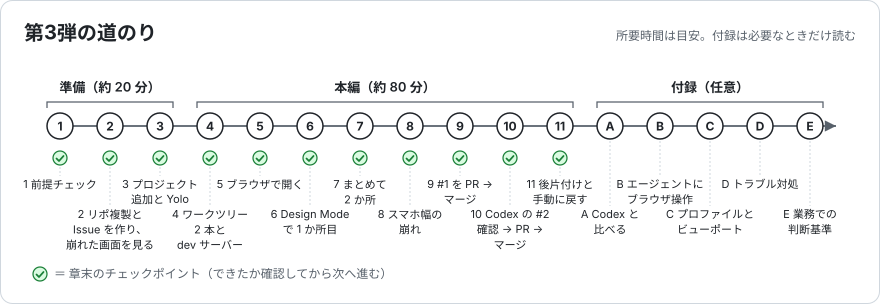

章ごとの「どこで・何をするか」は次のとおりです。今どこにいるか分からなくなったら、ここに戻ってください。

| 章 | どこで作業するか | やること | 目安 |
|---|---|---|---|
| 1〜3 | ターミナルと Orca の設定 | ツールの確認、テンプレートから複製、Issue を 2 件作成、Orca にプロジェクトを追加して Yolo に切り替え | 20 分 |
| 4〜5 | #1 と #2 のワークツリー | Issue からワークツリーを 2 本作り、dev サーバーを 2 つ（3000 と 3001）起こし、Orca のブラウザでページを開く | 15 分 |
| 6〜8 | #1（Claude Code） | Design Mode で崩れを直す。1 か所 → 2 か所まとめて → スマホ幅、の 3 回 | 35 分 |
| 9 | #1（Claude Code） | 差分を読んで PR #3 → マージ → Issue #1 クローズ | 10 分 |
| 10 | #2（Codex） | ブラウザで動作確認、Design Mode で仕上げ、PR #4 → マージ → Issue #2 クローズ | 15 分 |
| 11 | プライマリ | dev サーバー停止、pull して確認、ワークツリー削除、Yolo を手動に戻す | 5 分 |

本編で体験するのは、次のループです。**クリックして送る → エージェントが直す → ブラウザが自動で更新される → もう一度クリックして確かめる。** これを 1 か所ずつ、次に複数まとめて、最後にスマホ幅で行います。

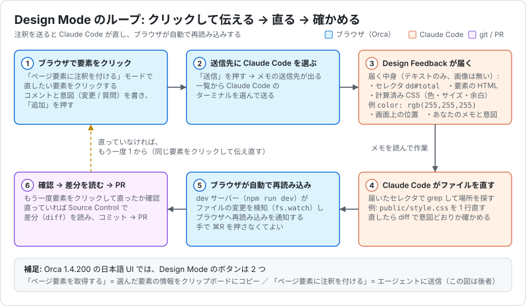

### 第1弾・第2弾との違い

| | 第1弾 | 第2弾 | 第3弾 |
|---|---|---|---|
| タスク | 同じバグ修正を Claude Code と Codex で競争 | 別々の機能追加を 3 本並列 | 見た目の崩れ 4 か所（Claude Code）とクーポン入力欄の追加（Codex）を 2 本並列 |
| エージェントへの指示 | 指示文を貼る | Issue の URL が入力欄に入っている | **ブラウザで要素をクリックし、メモを付けて送る** |
| 確認の仕方 | `npm test` と差分 | テスト・差分・PR のチェック | **ブラウザで見た目を確認**（保存すると自動で再読み込み）+ 差分 |
| 権限 | 手動 | Yolo | Yolo（第2弾と同じ条件。11 章で手動に戻す） |
| ゴール | PR を作るまで | マージ → コンフリクト解消 → Issue クローズ | 画面が直った状態で 2 本ともマージ → Issue クローズ |

### 用語（先に押さえておく）

| 用語 | 意味 |
|---|---|
| dev サーバー（開発用サーバー） | 手元の Mac で動く小さな Web サーバー。今回は `npm run dev` で起き、`public/` のページと `src/` の JavaScript をブラウザに配信します。ファイルを保存すると、開いているブラウザを **自動で再読み込み** します |
| ポート（port） | サーバーの「窓口番号」。`http://localhost:3000` の `3000` がポートです。同じ Mac で 2 つの dev サーバーを動かすときは、番号を分けます（2 本目は `3001`） |
| ブラウザタブ（Browser tab） | Orca のワークツリーの中で開く本物の Chromium。タブバーの「+」→「**新規ブラウザタブ**」で開きます。アドレスバー、戻る・進む、開発ツールがあります |
| Design Mode | ページ上の要素をクリックして、その **HTML・計算済み CSS・位置・あなたのメモ** をエージェントに渡す機能。Orca 1.4.200 の日本語 UI では、ブラウザのツールバーにある「**ページ要素に注釈を付ける**」（エージェントに送る）と「**ページ要素を取得する**」（クリップボードにコピー）の 2 つのボタンがこれに当たります |
| 注釈（Annotation） | Design Mode で要素に付けるメモ。「意図」として **変更**（こう直して）か **質問**（これは何？）を選びます。複数の要素に付けてから、まとめて送れます |
| 計算済み CSS（Computed styles） | CSS ファイルに何を書いたかではなく、ブラウザが **最終的にその要素に適用した値**。`color: rgb(255, 255, 255)` のように出ます。「書いたはずのルールが効いていない」を見つける手がかりになります |
| セレクタ（Selector） | 要素を指し示す書き方。`dd#total` は「`id="total"` の `dd` 要素」。エージェントはこれを手がかりにファイルの中を探します |
| ビューポート（Viewport） | ブラウザがページを表示する領域の大きさ。Orca のブラウザは「ブラウザメニュー」→「**ビューポートのサイズ**」で、スマホやタブレットの幅を再現できます |
| Source Control / PR パネル | 第2弾と同じ。右パネル上部の 3 番目（ソース管理 ⌘⇧G）と 4 番目（チェック）のアイコンです |

Issue と PR は **番号を共有** します。今回は Issue が #1〜#2 なので、PR は #3 から始まります。本書は #1 → #2 の順に PR を作る前提で、PR を #3、#4 と書きます。順番が違ったら、番号を読み替えてください。

### つまずきやすいところ（先に 3 つだけ）

本編でよく起きる迷い方です。どれも付録 D に直し方がありますが、先に知っておくと避けられます。

1. **dev サーバーは「ワークツリーの中」で起こす**。起動メッセージの「配信ディレクトリ」が `~/orca/workspaces/…` になっているかを毎回見ます（4-3）。プライマリで起こすと、エージェントがファイルを直しても画面が変わりません
2. **注釈の送信先は「今動いている Claude Code」**。送信メニューの下にある「新規 Agent」を選ぶと、Issue を読んでいない別のエージェントが新しく起動します（6-3）
3. **ブラウザタブとエージェントは同じワークツリーに置く**。ブラウザタブはワークツリーに属するので、#1 のブラウザから #2 の Codex には送れません（5-1、付録 D）

---

## 1. 前提チェック（5 分）

第1弾の 1〜3 章と第2弾の 1〜3 章が済んでいる（Orca がインストール済みで、「連携」の GitHub が Connected、Issue からワークツリーを作った経験がある）ことを前提にします。ターミナルで次を確認してください。

```bash
claude --version      # 2.x
codex --version       # codex-cli 0.15x
node --version        # v20 以上
gh auth status        # "Logged in to github.com account <あなたのID>" が出れば OK
```

Orca も起動しておきます。バージョンは、メニューバーの **Orca → Orca について**（About Orca）で確認できます。1.4.200 前後なら本書の表記と合うはずです。

✅ **ここまでできたら**: 4 つのコマンドが全部エラーなく終わり、Orca が起動している。

---

## 2. サンプルリポジトリを複製して、崩れた画面を見て、Issue を作る（10 分）

### 2-1. テンプレートから複製する

第1弾・第2弾と同じ要領で、第3弾のテンプレートリポジトリから **自分のアカウントに** 複製を作ります。

```bash
cd ~/Documents            # 第1弾・第2弾と同じ場所に置く前提で書きます
gh repo create orca-handson-3 --template misshii3/orca-handson-3 --private --clone
cd orca-handson-3
npm test
```

今回は **26 件すべて成功** するのが正常です。第2弾で追加した 3 つの関数（`formatDateJa`、`calcShipping`、`applyCoupon`）が入った状態が初期状態で、dev サーバーのテストが 4 件増えています。

```
ℹ tests 26
ℹ suites 7
ℹ pass 26
ℹ fail 0
```

### 2-2. dev サーバーを起こして、崩れた画面を見る

第3弾のサンプルには、第2弾の関数を使う **注文確認ページ** が入っています。まず普段のブラウザで、直す前の画面を見ておきます。

```bash
npm run dev
```

```
dev サーバーを起動しました: http://localhost:3000
配信ディレクトリ: /Users/<あなた>/Documents/orca-handson-3
public/ と src/ の変更を監視中。Ctrl+C で停止します。
```

普段使っているブラウザで `http://localhost:3000` を開きます。次の 4 か所が崩れています。**ここでは直しません。** 目で確認したら `Ctrl+C` で dev サーバーを止めます。

| # | 場所 | 崩れ方 |
|---|---|---|
| 1 | 右カードの「合計（税込）」の金額 | 文字が **見えない**（背景と同じ白） |
| 2 | 左カードの数量・単価・金額の列 | 数字が **左寄せ** で桁がそろわない |
| 3 | 「お届け予定日」 | `2026-09-18` のような **ISO 表記**（日本語表記にしたい） |
| 4 | 「注文を確定する」ボタン | **スマホ幅のときだけ** カードからはみ出す（PC 幅では分かりません。8 章で再現します） |

> **確認したら必ず `Ctrl+C` で止めてください。** ここで起こしたのはプライマリ（`~/Documents/orca-handson-3`）の dev サーバーです。止め忘れると、4-3 でワークツリーの dev サーバーが「ポート 3000 はすでに使われています」で起きません。

> **`file://` では動きません**: `public/index.html` をダブルクリックで開くと、`src/` の JavaScript を読み込めずに金額が空のままになります。必ず `npm run dev` の URL で開いてください。

### 2-3. タスク用の Issue を 2 件作る

テンプレートを複製しても **Issue はコピーされません**。第2弾と同じスクリプトで、自分のリポジトリに Issue を作ります。

```bash
bash scripts/seed-issues.sh
```

```
対象リポジトリ: <あなたのID>/orca-handson-3

作成しました: 注文確認ページの見た目の崩れを直す（合計金額・金額列・お届け日・スマホ幅のボタン）
  https://github.com/<あなたのID>/orca-handson-3/issues/1
作成しました: クーポン入力欄を追加する（コードを入力すると割引と合計が再計算される）
  https://github.com/<あなたのID>/orca-handson-3/issues/2

現在の Issue:
2  OPEN  クーポン入力欄を追加する（コードを入力すると割引と合計が再計算される）  ...
1  OPEN  注文確認ページの見た目の崩れを直す（合計金額・金額列・お届け日・スマホ幅のボタン）  ...
```

### 2-4. Issue を読む

`gh issue view 1` か GitHub の画面で、2 つの Issue を読んでおきます。

- **#1（Claude Code が担当）**: 2-2 で見た 4 か所の一覧と、それぞれの「期待する見た目」が表になっています。「色やサイズの細かい値は、参加者が Design Mode で要素を送るときにメモで指示する」とあります。**あなたがブラウザで要素を指して指示するのが前提** の Issue です
- **#2（Codex が担当）**: クーポン入力欄を追加する仕様です。入力例と期待する合計金額の表があります。こちらは Issue だけで実装できるように書いてあります

どちらの Issue にも「**dev サーバーを起動・停止・再起動しない**」とあります。dev サーバーはあなたが起こし、エージェントには触らせません（理由は 4 章）。

✅ **ここまでできたら**: `npm test` が 26 件成功し、崩れた画面を 3 か所（4 つ目はスマホ幅）目で確認し、`gh issue list` に #1 と #2 が出ている。

---

## 3. Orca にプロジェクトを追加して、Yolo に切り替える（5 分）

### 3-1. プロジェクトを追加する

第1弾 5 章と同じです。サイドバーの「プロジェクト」右の **+**（プロジェクトを追加）から `~/Documents/orca-handson-3` を選びます。サイドバーに `orca-handson-3` と `main ［プライマリ］` が出ます。

追加すると、左下に「**セットアップスクリプトを追加する**」のポップアップが出ることがあります。`package.json` から `npm install` を検出したという内容ですが、このサンプルに依存パッケージはないので **×** で閉じて構いません。

### 3-2. 「Agent の権限」を Yolo にする

第2弾 3-2 と同じく、練習リポなので Yolo を使います。理由と条件は第2弾の付録 C にまとめてあります。第3弾でも同じ 4 条件がそろっているか、いま一度確認してください。

- [ ] リポジトリが使い捨てで、認証情報や個人情報が含まれていない（複製したばかりの `orca-handson-3`）
- [ ] エージェントが取り消せない操作をしても困らない
- [ ] 社内コードやプロンプトを外部 LLM に送ることが組織のルールで許されている
- [ ] 出てきた差分を全部読む時間がある（9 章・10 章）

**設定（⌘,）→ Agent → 「Agent の権限」を「Yolo」** にします。「インストール済み」の欄で、Claude の起動コマンドに `--dangerously-skip-permissions`、Codex に `--dangerously-bypass-approvals-and-sandbox` が付いたことを確認します。

> **11 章で必ず手動に戻します。** 業務のリポジトリで Yolo のまま作業しないようにするための習慣です。

✅ **ここまでできたら**: サイドバーに `orca-handson-3` があり、「Agent の権限」が Yolo になっている。

---

## 4. Issue からワークツリーを 2 本作り、dev サーバーを起こす（10 分）

> 4〜8 章が本編の前半です。ワークツリーは第2弾と同じく Issue から作ります。第3弾で新しいのは、**ワークツリーごとに dev サーバーを起こす** ことです。

### 4-1. #1 のワークツリー（Claude Code）

サイドバーで `orca-handson-3` を選んで **⌘N**。第2弾 4-1 と同じダイアログです。

| 項目 | 入れる値 |
|---|---|
| プロジェクト | `orca-handson-3` になっているか確認（最後に触った別のプロジェクトが入っていることがあります） |
| 実行先 | `Local Mac` のまま |
| タブ | 「**GitHub**」に切り替える |
| 選ぶ Issue | **#1 注文確認ページの見た目の崩れを直す** |
| Agent | **Claude** |

「詳細設定」の名前欄は **空のままで構いません**。第2弾では Issue のタイトルから名前が作られましたが、今回はタイトルが日本語だけなので、Orca は `issue-1` という名前（ブランチは `<あなたのID>/issue-1`）を付けます。サイドバーのカード名も `issue-1` になります。

「**ワークツリーを作成する ⌘↩**」を押します。Claude Code が `claude '--dangerously-skip-permissions' --prefill '<Issue の URL>'` で起動し、初回は「Quick safety check」（**Yes, I trust this folder**）が出ます。答え方は第2弾 4-3 と同じです。

プロンプトが出たら、入力欄に Issue の URL が入っています。その **後ろに** 次の一文を足して ↩ で送ります。

```
この Issue を読んで、直す対象の 4 か所を把握してください。修正はまだしないでください。私がブラウザで要素を選んでメモを送るので、届いたものから順に直してください。
```

Claude Code が Issue を読んで「4 か所を把握しました。メモをお待ちします」のように答えたら OK です（文面は例）。

### 4-2. #2 のワークツリー（Codex）

同じ操作をもう一度。今度は **#2 クーポン入力欄を追加する** を選び、Agent を **Codex** にします。Codex の入力欄（`»`）にも Issue の URL が入っています。後ろに次を足して ↩。

```
この Issue を読んで実装してください。dev サーバーは私が別のターミナルで起動するので、起動・停止しないでください。終わったら何をどう実装したか日本語で報告してください。
```

Codex はこのまま裏で実装を進めます。**10 章まで放っておいて構いません**。あなたは #1 のワークツリーで Design Mode に取りかかります。

> ただし Codex は、Issue の「dev サーバーを触らない」を慎重に読んで「`npm test` を実行してよいか」と聞いたまま **止まっている** ことがあります。サイドバーの `issue-2` のカードにベル（あなたの番）が付いていたり、スピナーが数分止まったままだったりしたら、Codex のタブを開いて「実行してよい」と答えてください（10-1 にも書いてあります）。

> **なぜ dev サーバーをエージェントに起こさせないのか**: Yolo のエージェントは、動作確認のために自分で `npm run dev` を打つことがあります。同じポートで 2 つは起きられないので `EADDRINUSE` になり、別のポートを試して隣のワークツリーの dev サーバーと取り違えたり、動いているサーバーを `kill` したりします。**サーバーはあなたが管理し、エージェントにはファイルだけを直させる**。Issue にそう書いてあるのはこのためです。

### 4-3. #1 のワークツリーで dev サーバーを起こす

サイドバーで **#1 のワークツリー**（カード名 `issue-1`）を選び、中央のタブバー右端の **+** を押して「**新規ターミナル ⌘T**」を選びます。`zsh` のタブが増えるので、そこで次を打ちます。

```bash
npm run dev
```

```
dev サーバーを起動しました: http://localhost:3000
配信ディレクトリ: /Users/<あなた>/orca/workspaces/orca-handson-3/issue-1
public/ と src/ の変更を監視中。Ctrl+C で停止します。
```

**「配信ディレクトリ」がワークツリーのパス（`~/orca/workspaces/orca-handson-3/...`）になっていることを確認してください。** `~/Documents/orca-handson-3`（プライマリ）になっていたら、プライマリで起こしています。そのターミナルは `Ctrl+C` で止めて、サイドバーで #1 のワークツリーを選び直してからやり直します。

Claude Code と dev サーバーは、ペインを分割して並べておくと便利です（タブをペインの端にドラッグします。第1弾 7-3。下の図は上下に分割した例）。dev サーバーのログは 6 章で見ます。

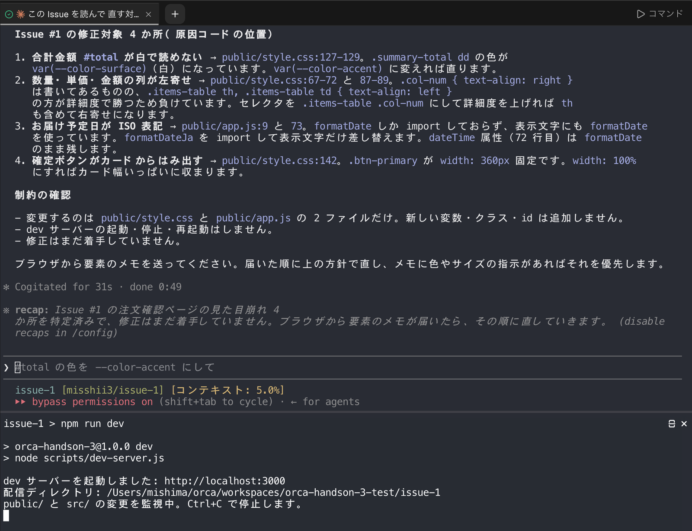

### 4-4. #2 のワークツリーでも起こす（ポートを変える）

サイドバーで **#2 のワークツリー**（カード名 `issue-2`）を選び、同じく **+ → 新規ターミナル** で次を打ちます。**`PORT=3001` を付けるのがポイント** です。

```bash
PORT=3001 npm run dev
```

`http://localhost:3001` で起きます。付け忘れると次のエラーになります。そのときは表示どおりに打ち直せば済みます。

```
エラー: ポート 3000 はすでに使われています（別のワークツリーの dev サーバーかもしれません）。
別のポートで起動するには:  PORT=3001 npm run dev
```

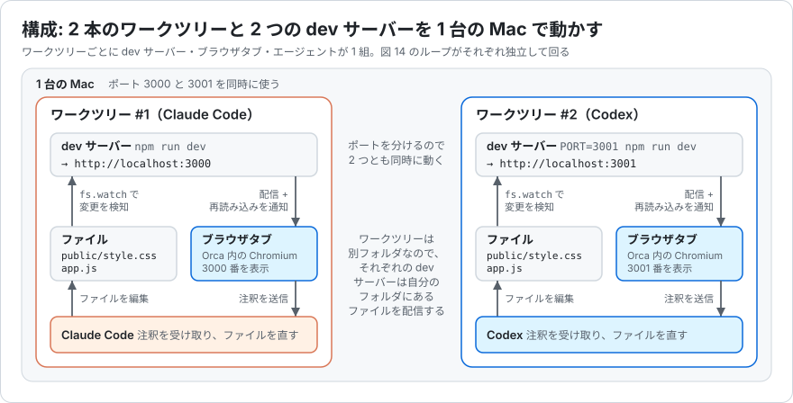

✅ **ここまでできたら**: サイドバーに 2 本のワークツリーが並び、#1 では Claude Code が待機・dev サーバーが 3000 で稼働、#2 では Codex が作業中・dev サーバーが 3001 で稼働している。

---

## 5. ワークツリーの中のブラウザでページを開く（5 分）

### 5-1. ブラウザタブを開く

サイドバーで **#1 のワークツリー** を選び、タブバー右端の **+** → 「**新規ブラウザタブ ⌘⇧B**」を選びます。アドレスバー付きのブラウザがタブとして開きます。

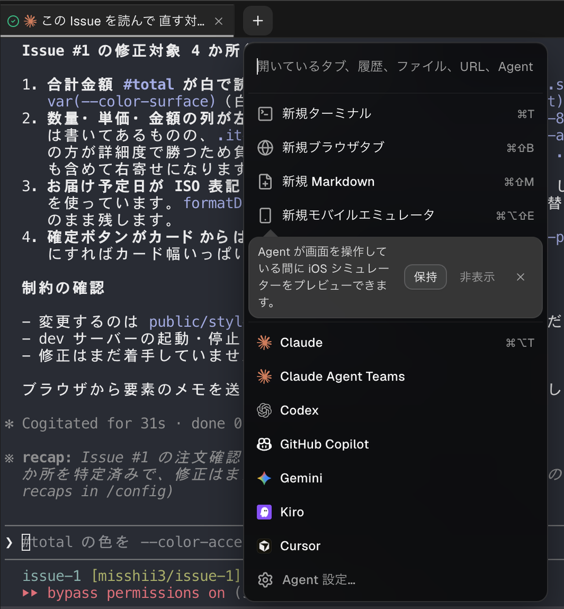

アドレスバーに `localhost:3000` と打って ↩。2-2 で見た注文確認ページが、**Orca の中に** 表示されます。

> Orca のブラウザは dev サーバーのポートを **自動では見つけません**。URL は自分で打ちます。ブラウザタブはワークツリーに属するので、#2 のワークツリーで開けば別のタブになります（10 章）。

### 5-2. ツールバーを眺める

アドレスバーの右に、アイコンが並んでいます。左から順に、マウスを乗せると名前が出ます。

| アイコン | 名前 | 使う章 |
|---|---|---|
| 「インポート」 | ブラウザデータをインポートする（Chrome の Cookie を取り込む） | 使わない（付録 C） |
| 照準（◎） | **ページ要素を取得する** | 6-6、付録 A |
| 吹き出し + | **ページ要素に注釈を付ける** | 6〜8 章、10 章 |
| ペン | スクリーンショットに描き込み | 使わない |
| 開発ツール | ブラウザの開発ツールを開く（Chrome の DevTools） | 使わない |
| 矢印 | デフォルトのブラウザで開く | 使わない |
| ··· | **ブラウザメニュー**（プロファイル、Cookie のインポート、**ビューポートのサイズ**、ブラウザ設定） | 8 章 |

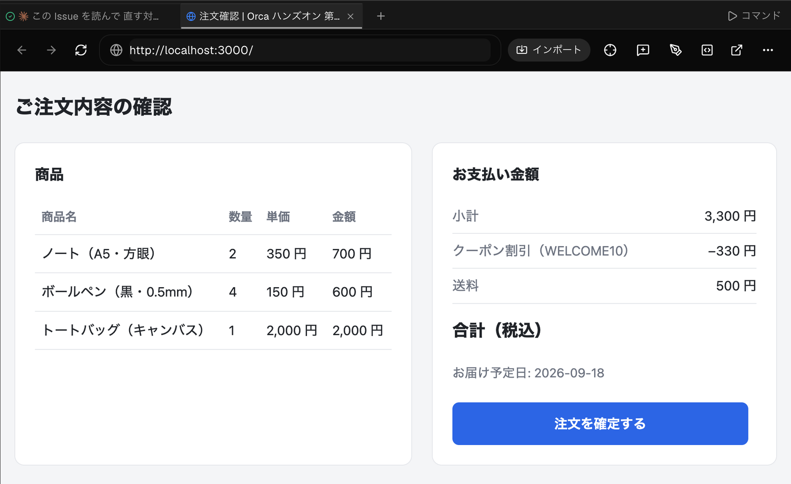

「ページ要素を取得する」と「ページ要素に注釈を付ける」が、公式ドキュメントで **Design Mode** と呼ばれている機能です。違いは 6-6 で触れます。

### 5-3. 崩れを再確認する

2-2 の表のうち 1〜3 を、Orca のブラウザで再確認します。合計金額が見えない、数字が左寄せ、日付が ISO 表記。4 つ目のスマホ幅は 8 章で再現します。

✅ **ここまでできたら**: #1 のワークツリーにブラウザタブがあり、`localhost:3000` の注文確認ページが表示され、ツールバーの「ページ要素に注釈を付ける」の位置が分かっている。

---

## 6. Design Mode で 1 か所目を直す（15 分）

いちばん分かりやすい「合計金額が見えない」から始めます。ここで 1 周まわすと、あとは同じことの繰り返しです。

### 6-1. 注釈モードにする

ツールバーの「**ページ要素に注釈を付ける**」（吹き出しのアイコン）を押します。ページの上に帯が出ます。

```
要素をクリックして Agent へのフィードバックを追加します。                    キャンセル
```

この状態でページ上にマウスを動かすと、要素に枠が付き、`dd "3,817 円" 82x32` のように **要素の種類・中の文字・大きさ** が小さく表示されます（セレクタは次のポップアップに出ます）。**クリックはまだしません**。少し動かして、枠が要素ごとに切り替わるのを見てください。

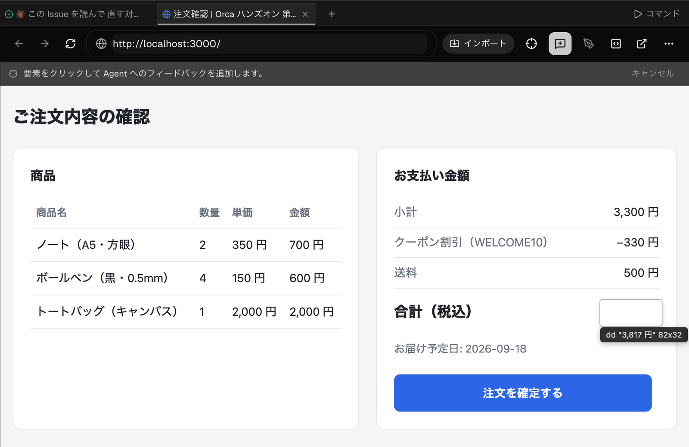

### 6-2. 合計金額をクリックしてメモを書く

「合計（税込）」の行の右端、金額が入っているはずの場所をクリックします。白い文字で見えませんが、1 つ上の行の「500 円」の真下あたりにマウスを乗せると `dd "3,817 円"` の枠が出ます。枠が出た状態でクリックすると、ポップアップが出ます。

| 部分 | 内容 |
|---|---|
| 見出し | `3,817 円` と `dd#total`（クリックした要素の文字とセレクタ） |
| 注釈コメント | 「Agent がここで何を変更する必要があるかを説明してください…」という欄 |
| 意図 | **変更** / **質問**（既定は変更） |
| ボタン | キャンセル / **追加 ⌘↩** |

注釈コメントに次のように書き、「意図」は **変更** のまま、「**追加**」（⌘↩）を押します。

```
背景と同じ白で読めません。強調色（--color-accent）にしてください
```

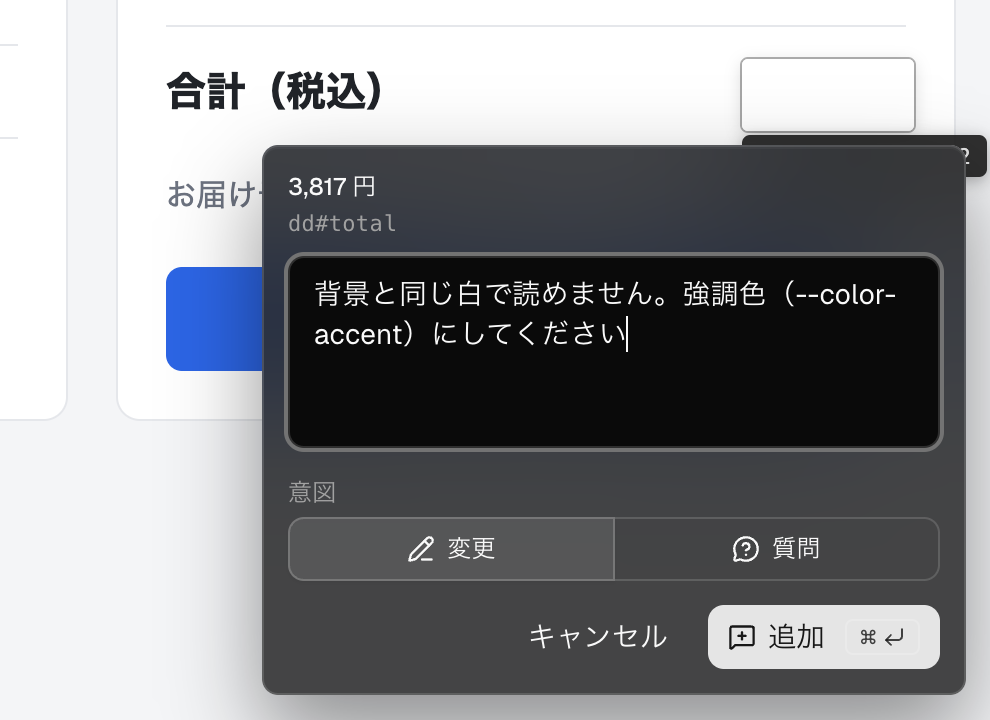

> **書き方のコツ**: 「何が困っているか」と「どうしたいか」を 1 行ずつ。CSS の値を知らなくても構いません（「読める色に」でも通じます）。Issue #1 には `--color-accent` という変数名が書いてあるので、ここでは指定しています。

追加すると、要素の右上に **①** のバッジが付き、右下に「**1 件の注釈**」のトレイ、上の帯が「1 件の注釈が準備できました。別の要素を選択するか、すべてのフィードバックをコピーしてください。」に変わります。ツールバーのアイコンにも件数が付きます。

### 6-3. Claude Code に送る

帯（またはトレイ）の「**送信**」を押します。「**メモの送信先**」のメニューが開き、上に **今動いている Claude Code**（「Claude」の下に「Done · 7m ago · ✳ <セッション名>」のように状態と経過時間が付いています）、下に「新規 Agent」の一覧が出ます。

**上の、今動いている Claude Code を選びます。** 「新規 Agent」の Claude を選ぶと、Issue を読んでいない別の Claude Code が新しく起動してしまいます。

送ると注釈は消え、注釈モードも終わります。次に注釈を付けるときは、ツールバーのボタンをもう一度押します。

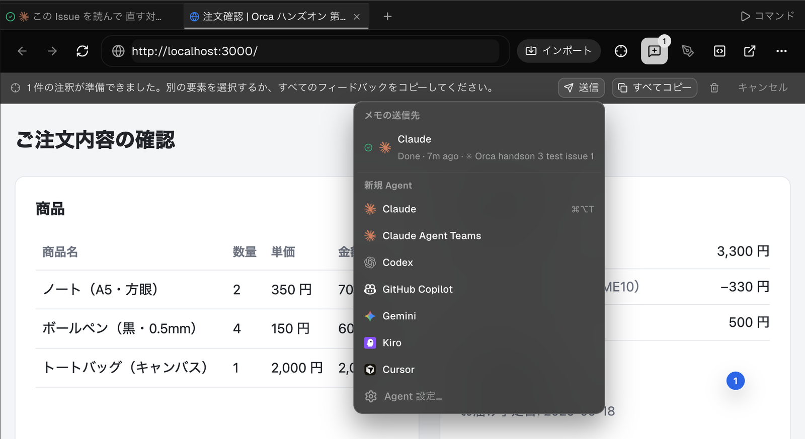

### 6-4. Claude Code に届いたものを読む

Claude Code のタブに切り替えます。**送った直後から Claude Code は動き始めています**（第1弾の Annotate と同じく、入力欄に貼られるだけでなく、そのまま送信されます）。画面に、届いた内容が表示されています。

```
Design Feedback: /
URL: http://localhost:3000/
Browser tab id: ...
Viewport: 962x992
1. dd "3,817 円"
Intent: change
Selector: dd#total
Location: .page > #summary-card > .summary > .summary-row > #total
Bounds: x=838, y=299, 82x32
Text: "3,817 円"
Nearby text:
- 合計（税込）
Computed styles:
- display: block
- color: rgb(255, 255, 255)
- font-size: 20px
- font-weight: 700
...
Full DOM path: body > main.page > section#summary-card > dl.summary > div.summary-row.summary-total > dd#total
HTML:
<dd id="total">3,817 円</dd>
Feedback: 背景と同じ白で読めません。強調色（--color-accent）にしてください
```

ここで見てほしいのは 3 点です。

- **Computed styles の `color: rgb(255, 255, 255)`**。CSS ファイルに何を書いたかではなく、ブラウザが最終的に適用した値です。「白い文字」という原因がここに書いてあります
- **Selector と Full DOM path**。エージェントはこれを手がかりに `public/style.css` の中から該当のルールを探します。ファイル名や行番号は届きません（ソースマップがないため）。それでもセレクタから `grep` で見つけられます
- **画像は届いていません**。届くのはテキストだけです。Claude Code は「見た目」を見ているのではなく、HTML と CSS の値を読んで直しています

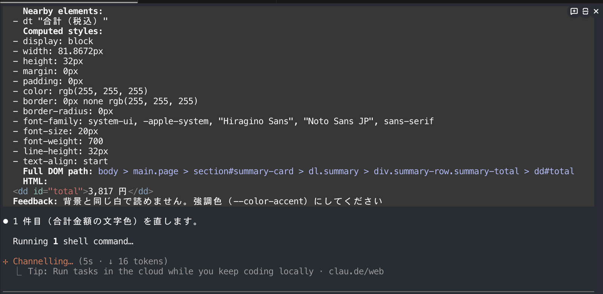

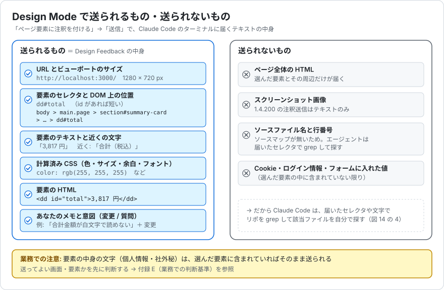

参考値: 今回の検証では、届いてから修正の報告まで **10〜40 秒** でした。報告は次のような内容になります（文面は例）。

```
原因: public/style.css の .summary-total dd が、コメントでは「強調色で目立たせる」と
書かれていながら、実際にはカード背景と同じ --color-surface（白）を指定していました。
変更: color: var(--color-surface) → var(--color-accent)（1 行）
```

### 6-5. ブラウザが勝手に更新される

ブラウザタブに戻ります。**何もしなくても** 合計金額が濃いピンクで表示されています。dev サーバーのタブには次の行が増えています。

```
変更を検知: public/style.css → ブラウザを再読み込みします
```

Claude Code が `style.css` を保存 → dev サーバーが変更を検知 → 開いているブラウザに「再読み込みして」と通知、という流れです。公式ドキュメントが「ホットリロード」と呼んでいる部分で、Orca ではなく **dev サーバー側の機能** です（このサンプルでは `scripts/dev-server.js` の中に 20 行ほどで書いてあります）。

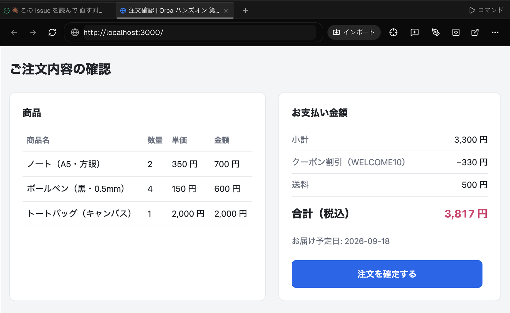

> 更新されないときは、アドレスバー左の **リロード** を押してください。ページを開いたあとに dev サーバーを起こし直した場合は、自動更新の接続が切れています（付録 D）。

### 6-6. もう一度クリックして確かめる（ページ要素を取得する）

見た目で直ったのは分かりますが、**値でも確認** しておきます。ここでツールバーのもう 1 つのボタン「**ページ要素を取得する**」（照準のアイコン）を使います。

押すと帯が「要素をクリックまたはマウスを移動し、C を押してコピーするか、S を押してスクリーンショットを行います。」に変わります。合計金額をクリックすると「**コピーされました**」と出て、要素の情報が **クリップボードに** 入ります。

タブバーの **+ → 新規 Markdown ⌘⇧M** で空のメモを開き、⌘V で貼ると、次のように読めます（抜粋）。

```
Attached browser context from http://localhost:3000/

Selected element:
dd
Selector: dd#total
Text content:
3,817 円
Computed styles:
  color: rgb(214, 51, 108)
HTML:
<dd id="total">3,817 円</dd>
```

`color` が `rgb(255, 255, 255)` から `rgb(214, 51, 108)`（`--color-accent` の `#d6336c`）に変わっています。確認できたら Markdown タブは閉じて構いません（保存しなくてよい）。帯の「キャンセル」で取得モードを抜けます。

| | ページ要素に注釈を付ける | ページ要素を取得する |
|---|---|---|
| 行き先 | **エージェント**（送信メニューで選ぶ） | **クリップボード** |
| メモ | 付けられる（意図: 変更 / 質問） | 付けられない |
| 複数の要素 | まとめて 1 回で送れる | 1 要素ずつ |
| 向いている場面 | 直させる、質問する | 自分で値を確かめる、別の場所に貼る |

✅ **ここまでできたら**: 合計金額が強調色で表示され、dev サーバーのログに「変更を検知」が出て、`git diff` 相当の変更が `public/style.css` の 1 行だけになっている（Source Control の Changes で確認できます）。

---

## 7. 2 か所まとめて直す（10 分）

残りの「数字が左寄せ」と「日付が ISO 表記」は、注釈を 2 つ付けてから **1 回で送ります**。第1弾の Annotate（10-2）で「まとめて送ると修正が一貫する」と学んだのと同じ考え方です。

### 7-1. 1 つ目: 金額の列

「**ページ要素に注釈を付ける**」を押し、左カードの金額のセル（例: `700 円`）をクリックします。ポップアップの見出しは `td "700 円"`、セレクタは `tr:nth-of-type(1) > td.col-num:nth-of-type(4)` のように、表の中の位置まで入ったものになります。

```
数量・単価・金額の列を、見出し（th）も含めて右寄せにしてください。CSS に .col-num のルールはありますが効いていないようです
```

「**追加**」を押します。**まだ送信しません。**

### 7-2. 2 つ目: お届け予定日

そのまま「お届け予定日」の日付（`2026-09-18` の部分）をクリックします。見出しは `time#delivery-date` です。

```
ISO 表記ではなく「2026年9月18日」のような日本語表記にしてください。src/date.js にある formatDateJa を使ってください。datetime 属性は今のままで
```

「**追加**」。トレイが「**2 件の注釈**」になり、ページ上に ①②のバッジが並びます。

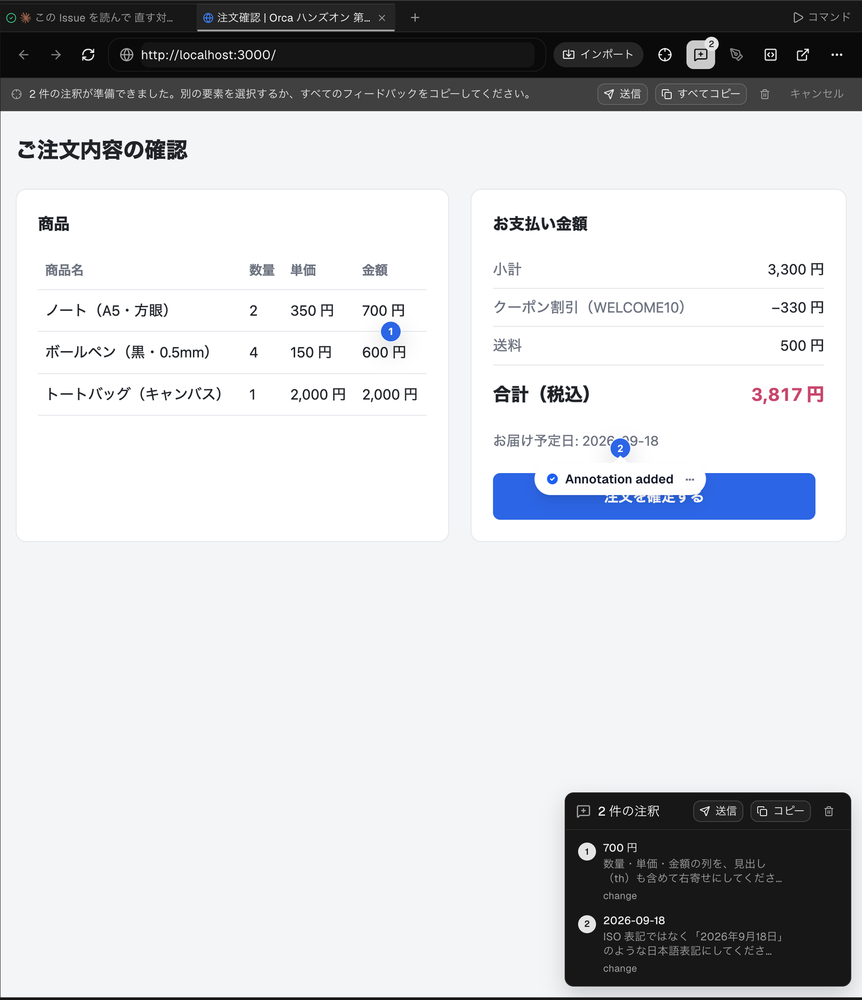

> **「質問」の使い方**: 「意図」を **質問** にすると、直させずに聞けます。たとえば金額の列に「なぜ .col-num の text-align が効かないのですか？」と質問にして送ると、Claude Code は「`.items-table td` の方が詳細度（specificity）が高いので負けています」のように答えます。仕組みを知りたいときに使ってください。今回は 2 つとも **変更** で進めます。

### 7-3. 送信して待つ

「**送信**」→ 今動いている Claude Code を選びます。Claude Code には `1. td "700 円" ... 2. time "2026-09-18" ...` と 2 件が番号付きで届き、順に直します。

参考値: 2 件で **約 1 分**。報告には次のような内容が含まれます（例）。

- `public/style.css`: `.col-num` → `.items-table .col-num` に変えて詳細度を上げた（1 行）
- `public/app.js`: `import { formatDate }` に `formatDateJa` を追加し、`renderDelivery` の表示側だけ `formatDateJa(date)` に変えた（2 行）。`datetime` 属性は `formatDate` のまま

### 7-4. 確かめる

ブラウザが自動で更新され、数字が右寄せに、日付が「2026年9月18日」になっています（日付はあなたが実施した日の 3 日後です）。

**CSS だけでなく JavaScript も Design Mode で直せた** ことに注目してください。届いたのは要素の情報だけですが、「日付の文字を変えたい」という要望から、Claude Code は `app.js` の描画処理まで辿っています。


✅ **ここまでできたら**: PC 幅で見える 3 か所がすべて直り、Source Control の Changes に `public/style.css` と `public/app.js` の 2 ファイルが出ている。

---

## 8. スマホ幅の崩れを直す（10 分）

4 つ目の崩れは、PC の幅では見えません。Orca のブラウザで **ビューポート**（表示領域）をスマホの大きさにして再現します。

### 8-1. ビューポートを 375px にする

ツールバー右端の「**···**」（ブラウザメニュー）→「**ビューポートのサイズ**」→「**Mobile M — 375 × 667**」を選びます。

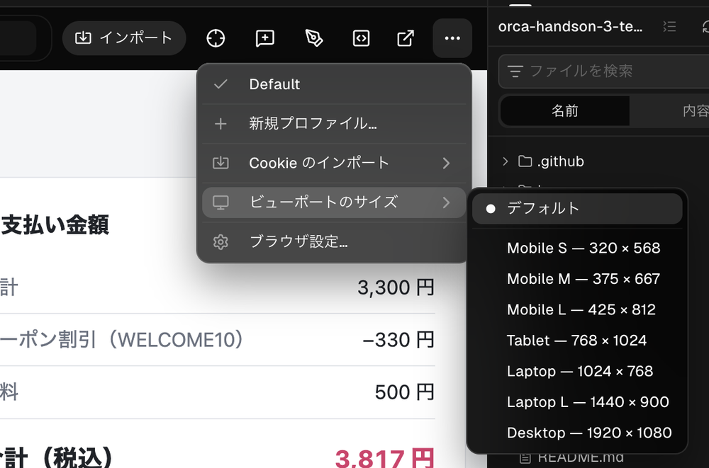

ページがスマホの画面サイズの枠の中に表示されます。1 カラムになり、商品とお支払い金額のカードが縦に並びます。枠の中をスクロールして一番下まで行くと、「**注文を確定する**」ボタンがカードの右端を突き抜けて、枠の外まで伸びています。これが 4 つ目です。

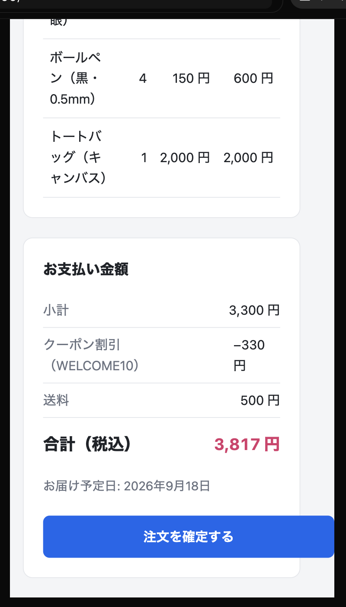

> **ビューポートとペインの幅は別物です**。ペインを狭くしてもページは狭くなりますが、`375px` ちょうどにはできません。スマホの再現にはこのメニューを使ってください。「新規モバイルエミュレータ」（タブバーの +）は iOS シミュレータを使う別の機能で、今回は使いません。

### 8-2. ボタンに注釈を付けて送る

そのまま「**ページ要素に注釈を付ける**」→ ボタンをクリック（`button#confirm-button`）→ 次を書いて「追加」→「送信」→ Claude Code。

```
スマホ幅（375px）でカードの右端からはみ出します。カードの内側に収めて、幅いっぱいに広げてください。PC 幅の見た目は変えないでください
```

届いた Computed styles には `width: 360px` が入っています。ボタンが **固定幅** で、カードの内側（375px 幅では 293px）より広いのが原因です。Claude Code は `width: 100%` に変える、または `max-width: 100%` を足す、のように直します（例。本書の検証では後者でした）。

### 8-3. 両方の幅で確かめる

自動更新後、ボタンがカードの内側に収まります。次に「···」→「ビューポートのサイズ」→「**デフォルト**」に戻して、PC 幅でもボタンが崩れていないことを確認します。**狭い幅を直したら広い幅も見る** のは、見た目の修正の基本です。

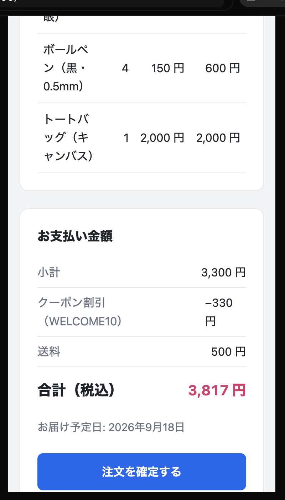

✅ **ここまでできたら**: Mobile M でボタンがカードに収まり、デフォルトに戻しても崩れていない。Issue #1 の 4 か所がすべて直っている。

---

## 9. #1 の差分を読んで PR にし、マージする（10 分）

ここからは第2弾の 6 章・8 章と同じ流れです。違いは **読む差分が HTML/CSS/JS** であることだけです。

### 9-1. 差分を読む

右パネルの **ソース管理（⌘⇧G）** → Changes に `public/style.css` と `public/app.js` の 2 ファイルが出ています。クリックして差分を読みます。見た目の修正で見る観点は次の 4 つです。

- [ ] **Issue の 4 か所以外を触っていないか**。`style.css` の変更が 3 か所（`.items-table .col-num`、`.summary-total dd` の色、`.btn-primary` の幅）、`app.js` が 2 か所（`import` に `formatDateJa`、`renderDelivery` の表示側）に収まっているか
- [ ] **他の要素に影響する変え方をしていないか**。たとえば数字を右寄せするのに `.items-table td` 全体を右寄せにしていたら、商品名まで右寄せになります
- [ ] **新しいクラスや変数を増やしていないか**（Issue #1 の仕様）
- [ ] `<time>` の **`datetime` 属性が `formatDate` のまま** か（機械が読む値は ISO のまま残す）

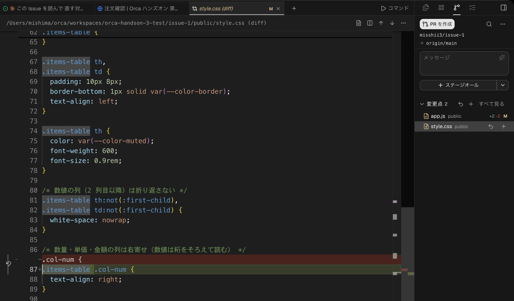

差分が **1〜3 行ずつの小さな修正 5 か所** に収まっていれば合格です。大きく書き換えられていたら、注釈で「Issue の範囲だけに戻して」と送り直してください（何度でも送れます）。

> **テストも回しておく**: タブバーの + → 新規ターミナルで `npm test`。UI の修正なので件数は変わらず **26 件成功** のままです。dev サーバーのターミナルはそのまま動かしておきます。

### 9-2. コミット → 公開 → PR → チェック → マージ

第2弾 6-2〜6-3、8 章と同じです。

1. 「**ステージオール**」→ コミットメッセージ欄の AI アイコンで文面を作らせ、読んで直し、末尾に **`Closes #1`** を足して「**Commit**」
2. 「**ブランチを公開**」→「**PR を作成**」（PR #3）
3. 右パネルの **チェック**（PR パネル）で `test` が Successful（緑）になるのを待つ。参考値: 1〜2 分
4. 「**Create merge commit**」（表記はリポジトリの既定方式）でマージ。「MERGED」になり、ボタンが「ワークスペースの削除」に変わる。**まだ削除しません**（11 章でまとめて）
5. `gh issue view 1` で Issue #1 が **CLOSED** になったことを確認

ボタンの文言と git の段階の対応、PR の状態の移り変わりは、次の 2 つの図のとおりです。


✅ **ここまでできたら**: PR #3 が MERGED、Issue #1 が CLOSED。`main` に見た目の修正 4 か所が入っている。

---

## 10. Codex の #2 をブラウザで確かめて、仕上げて、マージする（15 分）

### 10-1. 報告を読む

サイドバーで #2 のワークツリー（カード名 `issue-2`）を選びます。**⌘J** のジャンプパレットで `issue-2` と打って ↩ でも移動できます（第1弾 8 章）。Codex はとっくに終わっているはずです（参考値: 5〜8 分）。報告を読みます。`public/index.html` に入力欄と適用ボタン、`public/app.js` の末尾に `setupCouponForm()`、`public/style.css` の末尾にスタイル、という内容なら Issue どおりです。

> Codex は Issue の「dev サーバーを触らない」を慎重に読んで、「`npm test` を実行してよいか」（テストの中で別のサーバーを起こすため）と聞いてくることがあります。**実行してよい** と答えてください。また、実装の途中で **自分でブラウザタブを開いて** `orca screenshot` で画面を確かめることがあります（付録 B の機能をエージェントが自分で使っている状態です）。#2 のワークツリーに見覚えのないブラウザタブがあったら、それです。

### 10-2. ブラウザで動かす

#2 のワークツリーでタブバーの **+ → 新規ブラウザタブ**（Codex が開いたタブがあればそれを使って構いません）、アドレスバーに **`localhost:3001`**（4-4 で起こした方）と打って ↩。お届け予定日の下に「クーポンコード」の入力欄と「適用」ボタンが出ています。

> **3 か所の崩れが残っていて正常です**。#2 のブランチは、#1 をマージする前の `main` から切っています。合計金額が見えず、数字が左寄せで、日付が ISO のままなのは、#1 の修正がこのブランチに **まだ入っていない** からです。両方をマージすれば `main` では両方そろいます（11 章で確認）。

Issue #2 の表の 4 例をそのまま試します。

| 入力して「適用」 | 期待する表示 |
|---|---|
| `SAVE500` | 割引 −500 円、送料 500 円、合計 3,630 円、「クーポン「SAVE500」を適用しました」 |
| `ABC` | 割引（なし）0 円、送料 **無料**、合計 3,630 円、「クーポンコード「ABC」は使えません」 |
| 空欄 | 金額は変わらず、「クーポンコードを入力してください」 |
| `WELCOME10` | 最初の状態に戻る（−330 円、送料 500 円、合計 3,817 円） |

`SAVE500` と `ABC` の合計が同じ 3,630 円になるのは、Issue に書いてあるとおり「500 円引きで 3,000 円を下回ると送料がかかる」ためです。**仕様の表と画面を突き合わせる** のが、ここでのレビューです。

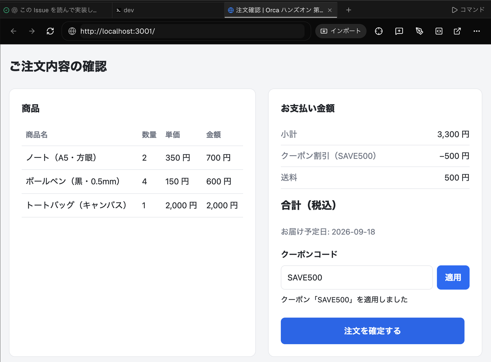

### 10-3. Design Mode で Codex に仕上げを頼む

`ABC` を入れて「使えません」のメッセージを表示させた状態で、「**ページ要素に注釈を付ける**」→ メッセージ（`p#coupon-message`）をクリック → 次を書いて「追加」→「送信」。送信先には **今動いている Codex** が出ます。

```
使えないコードのときのメッセージは、赤系の文字色で目立たせてください。適用できたときのメッセージは今のままでよいです
```

Codex にも同じ内容の `Design Feedback` が届き（Codex 向けには Markdown の見出し付きで整形されます）、そのまま動き始めます。参考値: 約 1 分。自動更新後、`ABC` で赤いメッセージが出れば OK です。**Design Mode はエージェントを選びません**。送信先メニューに出るものなら、どれにでも送れます。

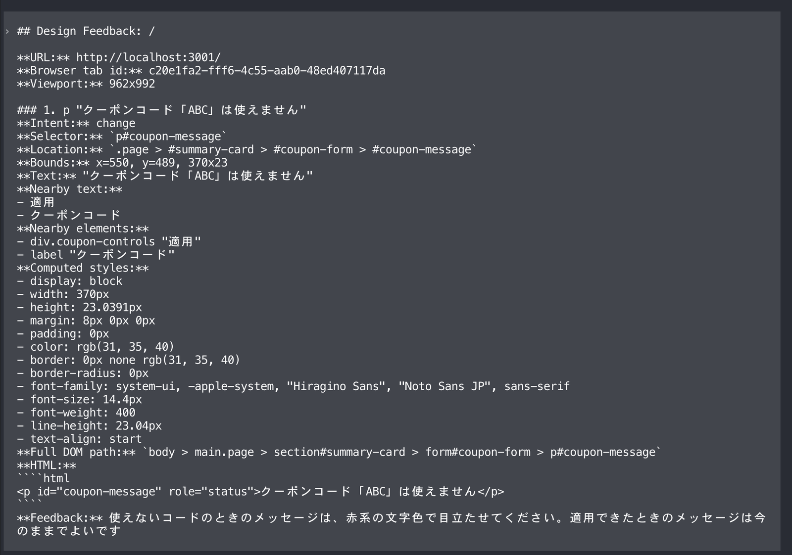

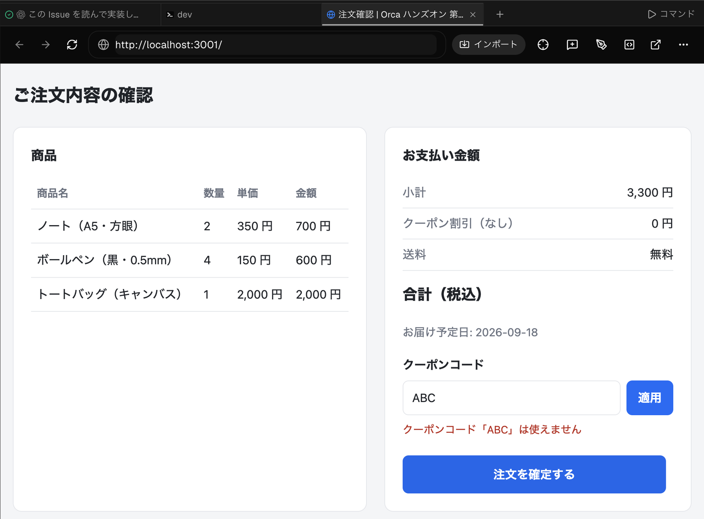

### 10-4. 差分 → PR → マージ

9 章と同じです。Changes は `public/index.html`、`public/app.js`、`public/style.css` の 3 ファイル。観点は次のとおり。

- [ ] `app.js` の **既存の関数と `import` 行が変わっていない**（末尾に追加されただけ）
- [ ] `style.css` の追加が **末尾のマーカーの下** にあり、既存のルールを変えていない
- [ ] `src/` と `test/` を触っていない

ステージオール → コミットメッセージ + **`Closes #2`** → ブランチを公開 → PR を作成（PR #4）→ チェック緑 → マージ。#1 が先に `main` に入っていますが、触る場所を分けてあるので競合しません。

> 万一「競合」と表示されたら、第2弾 10 章の手順（`git fetch origin && git merge origin/main` → 競合をレビュー → Codex に解消させる）で進めてください。

✅ **ここまでできたら**: PR #4 が MERGED、Issue #2 が CLOSED。

---

## 11. 後片付けと、手動に戻す（5 分）

### 11-1. dev サーバーを止める

#1 と #2 の dev サーバーのターミナルで、それぞれ **`Ctrl+C`** を押して止めます。ワークツリーを削除する前に止めるのが作法です（ポートが残らない）。

### 11-2. プライマリで結果を確かめる

サイドバーの `main ［プライマリ］` を選び、+ → 新規ターミナルで次を打ちます。

```bash
git pull
npm test        # 26 件成功のまま
npm run dev     # 今度はプライマリで起こす
```

**普段のブラウザ** で `http://localhost:3000` を開くと、4 か所が直っていて、クーポン入力欄もある画面になっています。これが 2 本の PR を合わせた `main` の状態です。確認したら `Ctrl+C`。

### 11-3. ワークツリーを 2 本削除する

第2弾 11-2 と同じです。サイドバーでワークツリーを右クリック → **削除**（または PR パネルの「ワークスペースの削除」）。マージ済みなので「Review N Branches」のトーストは出ません。ブラウザタブと dev サーバーのターミナルは、ワークツリーと一緒に閉じます。


### 11-4. 「Agent の権限」を手動に戻す

**設定 → Agent → 「Agent の権限」を「手動」** に。「インストール済み」の欄で、起動コマンドから `--dangerously-skip-permissions` が消えたことを確認します。

### 11-5. Issue を確認する

```bash
gh issue list                  # 何も出ない
gh issue list --state closed   # #1 と #2 が CLOSED
```

✅ **ここまでできたら**: サイドバーは `main ［プライマリ］` だけ。Yolo が手動に戻り、Issue 2 件が CLOSED、`main` で画面が直っている。

ここまでで本編は終わりです。お疲れさまでした。

---

## 付録 A（任意）: 同じ崩れを Codex にも直させて、比べる

第1弾の「レース」を Design Mode で再現します。所要 15 分。

1. 3 章の状態（Yolo）で、**Issue #1 からもう 1 本** ワークツリーを作り、Agent を **Codex** にします。Orca は `issue-1` と名付けようとしますが、Claude Code 用がすでにあるので「詳細設定」の名前欄に `issue-1-codex` などを入れます
2. `PORT=3002 npm run dev` で dev サーバーを起こし、ブラウザタブで `localhost:3002`
3. 6〜8 章と同じ注釈を付けて、送信先に **Codex** を選ぶ
4. Source Control の Changes を、Claude Code 側（9-1）と見比べる。第1弾 9-3 の見比べ方と同じです。詳細度の上げ方（`.items-table .col-num` か、`td.col-num` か、`!important` か）、ボタンの幅（`100%` か `auto` + `display: block` か）に違いが出やすいです
5. PR は作らず、ワークツリーを削除して終わり

**答えが同じなら正しさの手がかり、違うなら要件の曖昧さの手がかり**（第1弾 01_overview 5 章）。見た目の修正は特に「正解が複数ある」ことが多いので、比べる価値があります。

---

## 付録 B（任意）: エージェントにブラウザを操作させる（Orca CLI）

6 章で「エージェントには画像は届かない」と書きました。逆に、**エージェント自身にブラウザを見に行かせる** ことができます。Orca のターミナルから `orca` コマンドが使え、ワークツリーのブラウザタブを操作できます（第1弾 付録 A の続き）。

Claude Code に次のように頼んでみてください（ファイルは直させない指示にしています）。

```
このワークツリーの Orca のブラウザタブで http://localhost:3000 を開いています。orca snapshot で要素の一覧を取り、orca screenshot --format png --json で画面を撮って画像を読み、見た目の問題があれば日本語で箇条書きにしてください。ファイルは修正しないでください。
```

本書の検証（1.4.200）で確認できた挙動は次のとおりです。

- `orca snapshot` は、見出し・表のセル・ボタンに `@e1`〜 の **要素参照** を付けた一覧を返す。`orca hover --element @e4` や `orca click --element @e4` で実際に操作できる。`dt` / `dd`（小計・合計の行）には参照が付かなかった
- `orca screenshot --format png --json` は、画像を **base64 で `result.data` に** 返す（ファイルには保存しない）。Claude Code はこれをデコードして画像として読み、「ボタンがカードを 42px 超えている」「−330 円 が 2 行に折り返している」のように **画像から** 指摘してきた
- `orca full-screenshot`（ページ全体）は 1.4.200 では継ぎ目が壊れた画像になった。スクロールして `orca screenshot` を繰り返す方が確実
- `orca set device --name "iPhone 12"` で、8 章のビューポート切り替えを CLI からもできる
- 公式は、エージェント向けのスキル（使い方の説明書）を `npx skills add https://github.com/stablyai/orca --skill orca-cli` で入れることを勧めています。入れなくても `orca --help` を読んで使い始めます

**あなたが見ているブラウザタブをエージェントも操作します**。スクロールされたり別のページに遷移したりするので、自分で操作している最中には頼まないでください。

---

## 付録 C（任意）: ブラウザプロファイルとビューポートの詳細

ツールバー右端「···」（ブラウザメニュー）の中身です。

| 項目 | 内容 |
|---|---|
| Default / 新規プロファイル… | **ブラウザプロファイル**。Cookie・localStorage・キャッシュがプロファイルごとに完全に分かれます。「ログイン中のユーザー」と「未ログイン」を別プロファイルで並べて確認する、といった使い方。切り替えるとそのペインの全タブに効きます |
| Cookie のインポート | Chrome / Edge から Cookie を取り込みます（ツールバーの「インポート」と同じ）。Google アカウントのログインは取り込めないので、必要なら Orca のブラウザで直接ログインします |
| ビューポートのサイズ | デフォルト / Mobile S 320×568 / Mobile M 375×667 / Mobile L 425×812 / Tablet 768×1024 / Laptop 1024×768 / Laptop L 1440×900 / Desktop 1920×1080。8 章で使いました。CSS の `@media (max-width: …)` の境目（このサンプルは 720px）をまたいで見比べるのに便利です |
| ブラウザ設定… | 設定 → Browser。プロファイルの管理（Cookie の初期値、User-Agent、ビューポートの既定値）とリンクの開き方 |

CLI からは `orca tab profile list` / `orca tab profile create` / `orca tab profile set` で同じことができます。

タブバーの + にある「新規モバイルエミュレータ ⌘⌥⇧E」は iOS シミュレータ（Xcode が必要）を Orca の中で動かす機能で、ビューポートの切り替えとは別物です。Web ページの幅を確かめるだけなら、ビューポートのサイズで十分です。

---

## 付録 D: トラブルシューティング

第1弾の付録 B（Orca 一般、`gh`、macOS の許可、PATH）と第2弾の付録 B（Issue からの作成、PR パネル、マージ、競合）も合わせて参照してください。ここには第3弾で新しく出る症状だけを載せます。

| 症状 | 見るところ・直し方 |
|---|---|
| `npm run dev` が `エラー: ポート 3000 はすでに使われています` と言う | 別の dev サーバーが動いている。**4-3（#1）で出たなら**、2-2 で起こしたプライマリの dev サーバーを止め忘れている可能性が高い。そのターミナルで `Ctrl+C` してから、3000 のまま起こし直す。**4-4（#2）で出たなら** 正常で、表示どおり `PORT=3001 npm run dev` にする。誰が使っているか調べるなら `lsof -i :3000` |
| ブラウザで `localhost:3000` が「接続できません」 | dev サーバーが止まっている。そのワークツリーの dev サーバーのターミナルを見る。`Ctrl+C` で止めていたら `npm run dev` で起こし直す |
| ページは出るが金額が空、コンソールにエラー | `file://` で開いている、または `public/index.html` を Orca のファイルプレビューで開いている。必ず `http://localhost:…` で開く |
| エージェントがファイルを直したのにブラウザが変わらない | (1) アドレスバー左のリロードを押す。(2) dev サーバーのターミナルに「変更を検知」が出ているか。出ていなければエージェントが **別のワークツリーのファイル** を直している（4-3 の配信ディレクトリを確認）。(3) ページを開いた **あとで** dev サーバーを起こし直すと自動更新の接続が切れる。一度リロードすれば戻る |
| 「ページ要素に注釈を付ける」を押したのに枠が出ない | ページの上の帯（「要素をクリックして Agent へのフィードバックを追加します。」）が出ているか。出ていれば、マウスをページ上で動かす。出ていなければもう一度押す |
| 「送信」のメニューに動いている Claude Code が出ない | Claude Code のタブが閉じている、または別のワークツリーのブラウザから送っている。ブラウザタブとエージェントは **同じワークツリー** にあること。「新規 Agent」から起こすと Issue を読んでいない別のエージェントになるので、そのときは Issue の URL も一緒に伝える |
| 送ったのに Claude Code が動かない | Claude Code のタブを開いて入力欄を見る。前の作業中（スピナー）なら終わるまで待つ。入力欄に文が入ったまま止まっていれば ↩ を押す |
| Claude Code が `src/date.js` の `formatDate` 自体を日本語表記に変えてしまった | Issue #1 の仕様違反（`src/` は触らない）。注釈で「`src/` は変えずに `app.js` の表示側だけ `formatDateJa` を使って」と送り直す。`git checkout src/date.js` で戻してもよい |
| Claude Code が `!important` で直した | 動きますが、詳細度を上げる（`.items-table .col-num`）方が筋がよい。注釈の意図を **質問** にして「`!important` を使わない直し方は？」と聞くと説明してくれます |
| Claude Code が `npm run dev` を打とうとした / dev サーバーを止めた | Issue の受け入れ条件に「起動・停止しない」とあるが、Yolo では止められない。止まったら自分で起こし直し、「dev サーバーは私が管理するので触らないで」と伝える |
| ビューポートを Mobile M にしたらページが小さく中央に出て、下が見えない | それが正常。枠の中でスクロールする。戻すときは「···」→「ビューポートのサイズ」→「デフォルト」 |
| Mobile M にしてもボタンがはみ出さない | 8 章より前にボタンの幅を直してしまった（7 章で Claude Code が先回りして直すことがある）。Source Control で `style.css` の `.btn-primary` を見て `width: 100%` になっていれば、それで OK。8-1 の再現だけ見て 8-3 へ |
| Codex に注釈が届かない | 送信先メニューに Codex が出ているか。出ていれば届く。出ていなければ「ページ要素を取得する」でコピーし、Codex の入力欄に ⌘V で貼って ↩（内容は同じ）|
| Codex が「`npm test` を実行してよいか」と聞いてくる | Issue の「dev サーバーを触らない」を慎重に読んでいる。テストは自分で空きポートにサーバーを起こして終了するので、「実行してよい」と答える |
| #2 のワークツリーに、開いた覚えのないブラウザタブがある | Codex が確認のために `orca` CLI で開いたもの。そのまま使ってよい |
| PR #4 のチェックが赤 | `npm test` はサーバー起動も含むので、`scripts/dev-server.js` を壊すと落ちる。チェック名をクリックしてログを読み、PR パネルの「Fix broken checks」でエージェントに渡す |
| PR #4 が「競合」 | #2 が `app.js` の `import` 行や既存の関数を触ると起きる。第2弾 10 章の手順で `origin/main` を取り込み、Codex に解消させる |
| ワークツリーを削除したら dev サーバーが残った | 削除前に `Ctrl+C` していない場合。`lsof -i :3000` で PID を調べて `kill <PID>` |
| Yolo を戻し忘れた | 設定 → Agent → 「Agent の権限」を手動に。「インストール済み」の欄でフラグが消えたことを確認 |

---

## 付録 E: 業務で Design Mode を使うときの判断基準

第1弾の付録 C（Yolo）、第2弾の付録 C（差分を全部読む）に続く、第3弾の持ち帰りです。

### 何が送られるかを知っておく

6-4 の図のとおり、注釈を送ると **要素のテキスト・HTML・計算済み CSS・DOM 上の位置・あなたのメモ** がエージェント（= その先の LLM）に送られます。画像は送られません。ここで注意するのは次の 2 つです。

- **要素の中の文字がそのまま送られる**。業務の画面で、顧客名・金額・社外秘の文言が入った要素を選べば、それが送られます。ダミーデータで動かした画面で選ぶ、または個人情報が入っていない要素を選ぶ
- **「Nearby text」として周りの文字も送られる**。選んだ要素の隣に何が表示されているかにも気を配る

これは Orca の問題ではなく、「エージェントに何を見せるか」というあなたの判断です。差分を全部読むのと同じく、**送る前に、何が送られるかを想像する** 習慣を付けてください。

### 見た目の修正でも差分を読む

Design Mode は「クリックして送る」だけなので、指示が短くなります。短い指示ほど、エージェントは **範囲を広げて** 直しがちです（9-1 の観点）。1 行の修正で済むはずのものが 20 行になっていたら、送り直す。見た目の修正だから軽い、とは考えないでください。

### 向いている場面・向かない場面

| 向いている | 向かない |
|---|---|
| 「ここが崩れている」を **要素で指せる** とき（色、余白、寄せ、幅） | ページ全体のレイアウト方針を変えるとき（要素 1 つでは伝わらない） |
| 原因が **計算済み CSS に出る** とき（効いていないルール、意図と違う値） | 動きのバグ（クリックしても何も起きない、など）。これは第1弾のようにテストや再現手順で伝える |
| 直したらすぐ **ブラウザで確認できる** 環境があるとき（dev サーバー） | dev サーバーが手元にない、ビルドに何分もかかる |

---

## 参考リンク

- ワークツリーごとのブラウザ（タブ、アドレスバー、ビューポート、プロファイル）: https://www.onorca.dev/docs/browser/overview
- Design Mode（要素をクリックしてエージェントに送る）: https://www.onorca.dev/docs/browser/design-mode
- Recipe: Fix a UI bug with Design Mode: https://www.onorca.dev/docs/recipes/design-mode-fix
- ブラウザプロファイル: https://www.onorca.dev/docs/browser/profiles
- Orca CLI（ブラウザ操作、`orca snapshot` / `orca screenshot`）: https://www.onorca.dev/docs/cli/overview 、 https://www.onorca.dev/docs/cli/reference
- GitHub 連携（Issue からのワークツリー、PR パネル、マージ）: https://www.onorca.dev/docs/review/github
- 第1弾: https://github.com/misshii3/orca-handson 、 第2弾: https://github.com/misshii3/orca-handson-2
